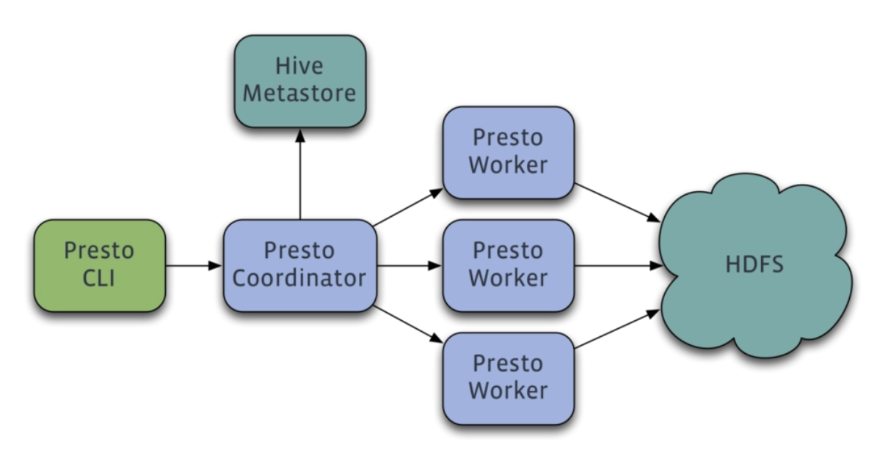
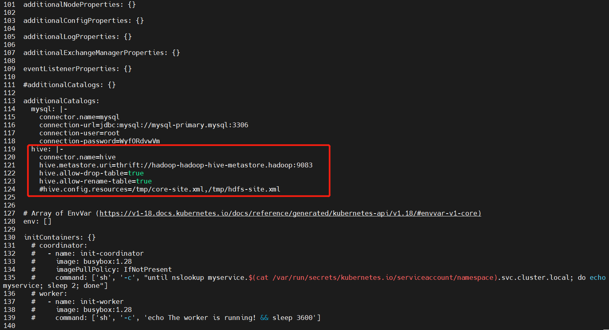
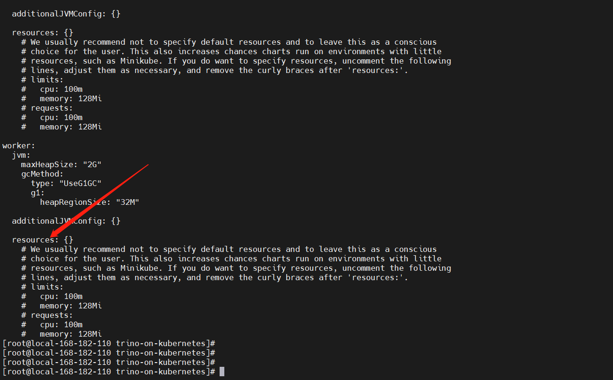
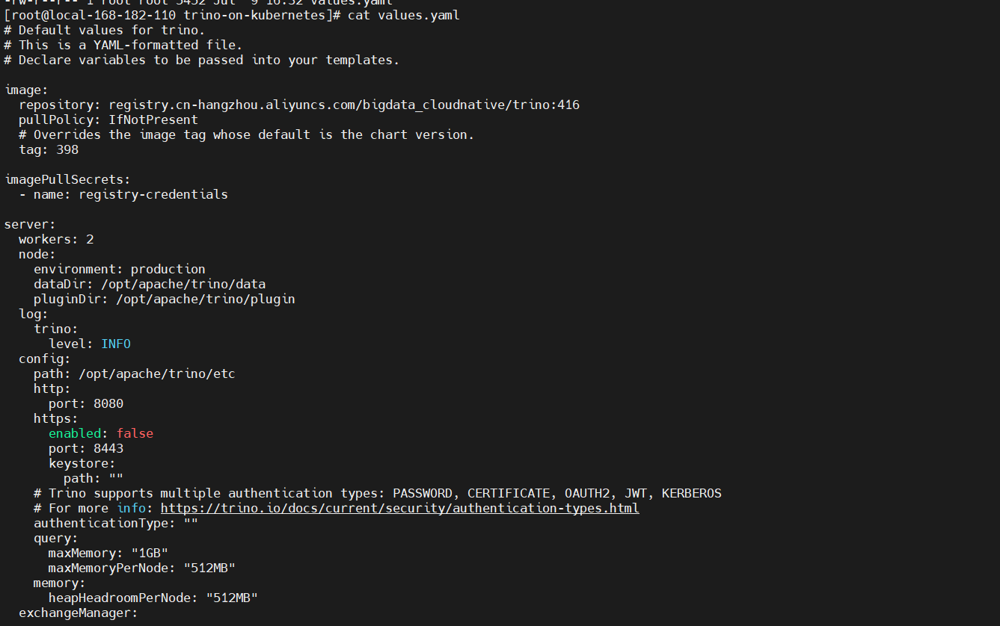
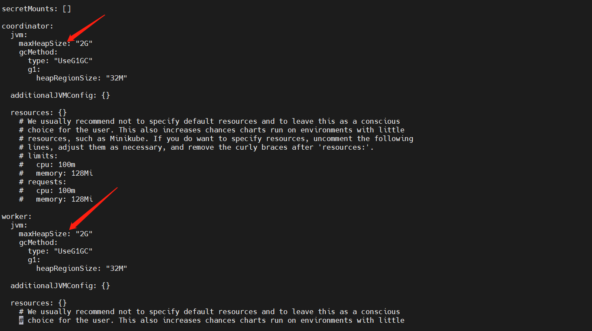
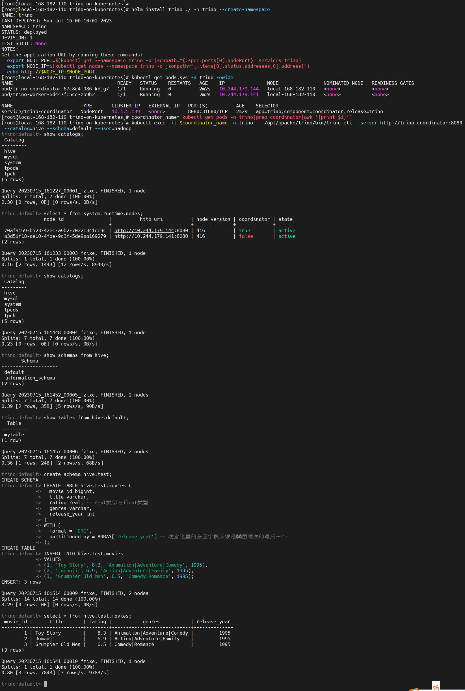

## 一、概述
Trino on Kubernetes（Trino在Kubernetes上的部署）是将Trino查询引擎与Kubernetes容器编排平台相结合，以实现在Kubernetes集群上部署、管理和运行Trino的解决方案。

Trino（之前称为Presto SQL）是一个高性能的分布式SQL查询引擎，旨在处理大规模数据集和复杂查询。Kubernetes是一个流行的开源容器编排平台，用于自动化容器的部署、扩展和管理。

将Trino部署在Kubernetes上可以带来一些优势：

- **弹性扩展**：Kubernetes提供了自动化的容器扩展功能，可以根据工作负载的需求自动增加或减少Trino的实例数。这样，可以根据查询负载的变化进行弹性伸缩，提高性能和资源利用率。

- **高可用性**：Kubernetes具有容错和故障恢复的能力。通过在Kubernetes集群中部署多个Trino实例，可以实现高可用性架构，当其中一个实例失败时，其他实例可以接管工作，保证系统的可用性。

- **资源管理**：Kubernetes提供了资源调度和管理的功能，可以控制Trino实例使用的计算资源、存储资源和网络资源。通过适当配置资源限制和请求，可以有效地管理Trino查询的资源消耗，防止资源冲突和争用。

- **简化部署和管理**：Kubernetes提供了声明性的配置和自动化的部署机制，可以简化Trino的部署和管理过程。通过使用Kubernetes的标准工具和API，可以轻松地进行Trino实例的创建、配置和监控。

- **生态系统整合**：Kubernetes具有丰富的生态系统和集成能力，可以与其他工具和平台进行无缝集成。例如，可以与存储系统（如Hadoop HDFS、Amazon S3）和其他数据处理工具（如Apache Spark）集成，实现数据的无缝访问和处理。

需要注意的是，将Trino部署在Kubernetes上需要适当的配置和调优，以确保性能和可靠性。此外，对于大规模和复杂的查询场景，可能需要考虑数据分片、数据划分和数据本地性等方面的优化。

总之，Trino on Kubernetes提供了一种灵活、可扩展和高效的方式来部署和管理Trino查询引擎，使其能够更好地适应大数据环境中的查询需求。

这里只是讲解部署过程，想了解更多的trino的内容，可参考我以下几篇文章：

- [大数据Hadoop之——基于内存型SQL查询引擎Presto（Presto-Trino环境部署）](https://mp.weixin.qq.com/s?__biz=MzI3MDM5NjgwNg==&mid=2247484420&idx=1&sn=6a8851681fda8896048f7c76b52ab1f7&chksm=ead0f8eddda771fbcec6cac7fb14661379568c26749c70b93c2cca8ff63d409c21c7f613573c#rd)
- [【大数据】Presto（Trino）SQL 语法进阶](https://mp.weixin.qq.com/s?__biz=MzI3MDM5NjgwNg==&mid=2247487976&idx=1&sn=07d402c3bdf94adf71bdfca59a2667f7&chksm=ead0ed01dda76417ac92ce3ad43007164dc7c5daaa2cb5037144680a800a3c41b588b343de84#rd)
- [【大数据】Presto（Trino）REST API 与执行计划介绍](https://mp.weixin.qq.com/s?__biz=MzI3MDM5NjgwNg==&mid=2247487989&idx=1&sn=c4a0ee247a2b9ee1c031d1738fe4ac7a&chksm=ead0ed1cdda7640ad8b24370c218d629ca9f474176e55ff1d709391abf223ab3b2e862f3d689#rd)
- [【大数据】Presto（Trino）配置参数以及 SQL语法](https://mp.weixin.qq.com/s?__biz=MzI3MDM5NjgwNg==&mid=2247487957&idx=1&sn=f3cdbb7eaf2a9ddb398a8f60eef88024&chksm=ead0ed3cdda7642af685843e010809ba4f222e89227019873bad5ddaea89380940a392eece50#rd)

如果想单机容器部署，可以参考我这篇文章：[【大数据】通过 docker-compose 快速部署 Presto（Trino）保姆级教程](https://mp.weixin.qq.com/s?__biz=MzI3MDM5NjgwNg==&mid=2247487951&idx=1&sn=de71c3ae3b4b0d3a5cd89efef11b5e60&chksm=ead0ed26dda76430f30ff4e95fbac5870b2b3e0f62c5eba456c1244ff1de5d928a800c687db0#rd)



## 二、开始部署

### 1）安装 git
```bash
# 1、安装 git
yum -y install git 
```
### 2）下载trino安装包

```bash
git clone git@github.com:HBigdata/trino-on-kubernetes.git
cd trino-on-kubernetes
```
### 3）配置数据源

```bash
cat -n values.yaml
```

### 3）配置资源限制 requests 和 limits

### 4）修复 trino 配置

JVM 内存配置

### 5）开始部署

```bash
# git clone git@github.com:HBigdata/trino-on-kubernetes.git
# cd trino-on-kubernetes

# 安装
helm install trino ./ -n trino --create-namespace

# 更新
helm upgrade trino ./ -n trino

# 卸载
helm uninstall trino -n trino
```
### 6）测试验证

```bash
coordinator_name=`kubectl get pods -n trino|grep coordinator|awk '{print $1}'`

# 登录
kubectl exec -it $coordinator_name -n trino -- ${TRINO_HOME}/bin/trino-cli --server http://trino-coordinator:8080 --catalog=hive --schema=default --user=hadoop

# 查看数据源
show catalogs;
# 查看mysql库
show schemas from hive;
# 查看表
show tables from hive.default;

create schema hive.test;

# 创建表
CREATE TABLE hive.test.movies (
  movie_id bigint,
  title varchar,
  rating real, -- real类似与float类型
  genres varchar,
  release_year int
)
WITH (
  format = 'ORC',
  partitioned_by = ARRAY['release_year'] -- 注意这里的分区字段必须是上面顺序的最后一个
);

#加载数据到Hive表
INSERT INTO hive.test.movies
VALUES 
(1, 'Toy Story', 8.3, 'Animation|Adventure|Comedy', 1995), 
(2, 'Jumanji', 6.9, 'Action|Adventure|Family', 1995), 
(3, 'Grumpier Old Men', 6.5, 'Comedy|Romance', 1995);

# 查询数据
select * from hive.test.movies;
```



到这里完成 `trino on k8s` 部署和可用性演示就完成了，有任何疑问请关注我公众号：`大数据与云原生技术分享`，加群交流或私信沟通，如本篇文章对您有所帮助，麻烦帮忙一键三连（点赞、转发、收藏）~